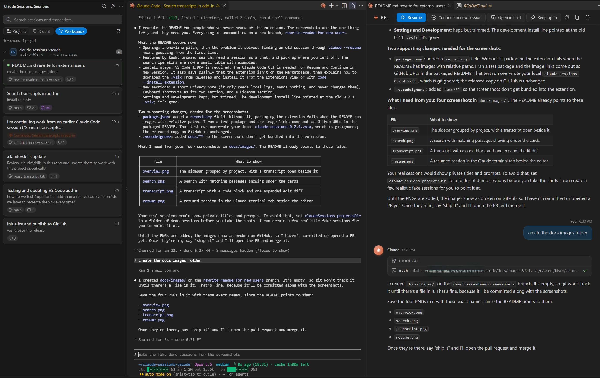
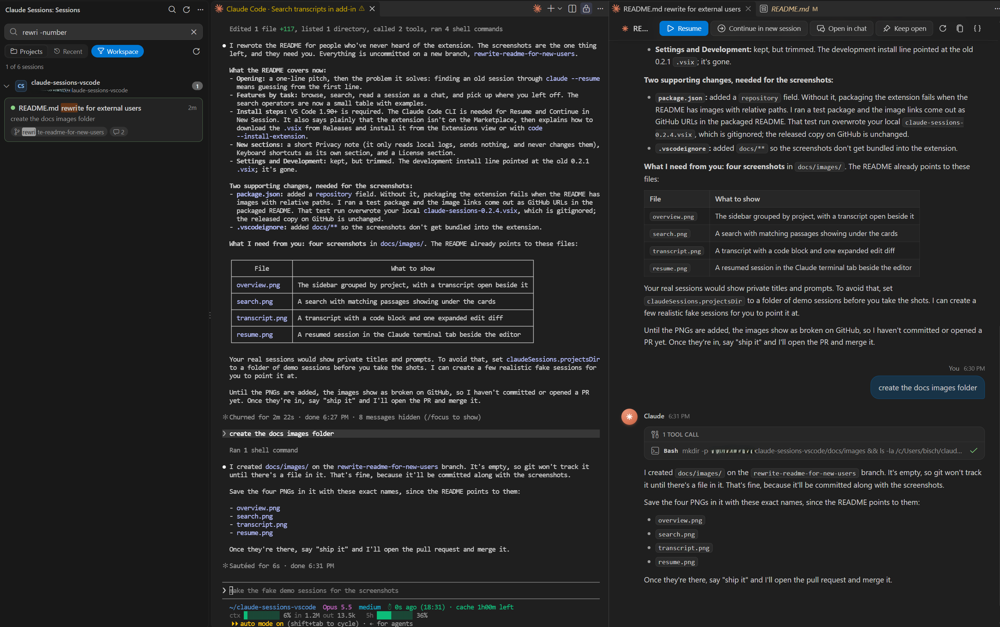
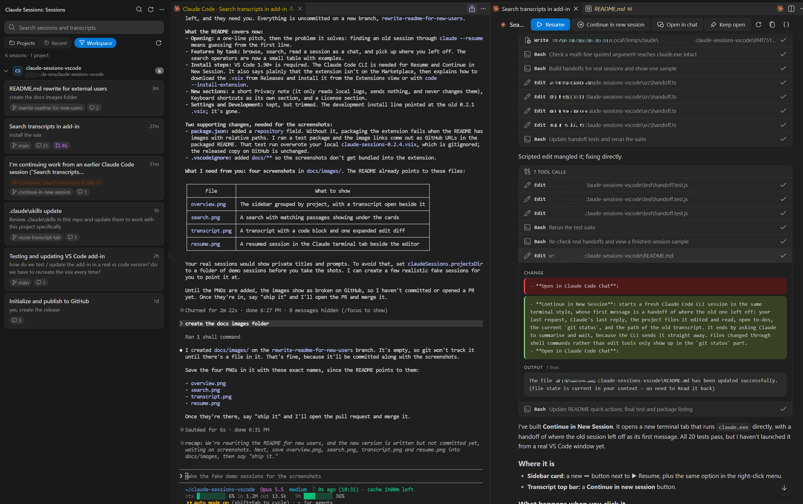
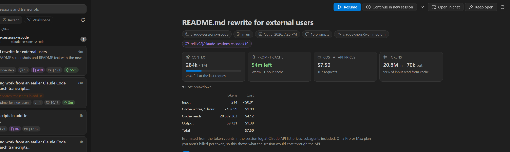
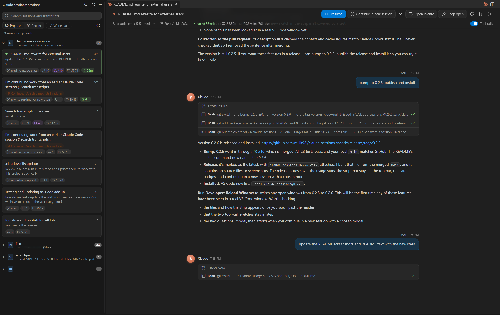
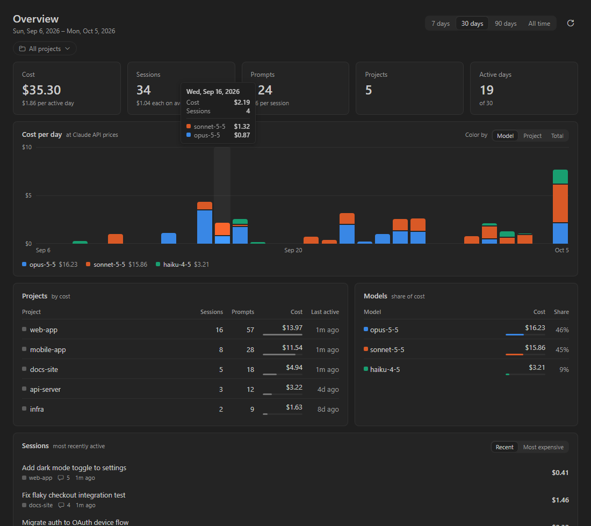
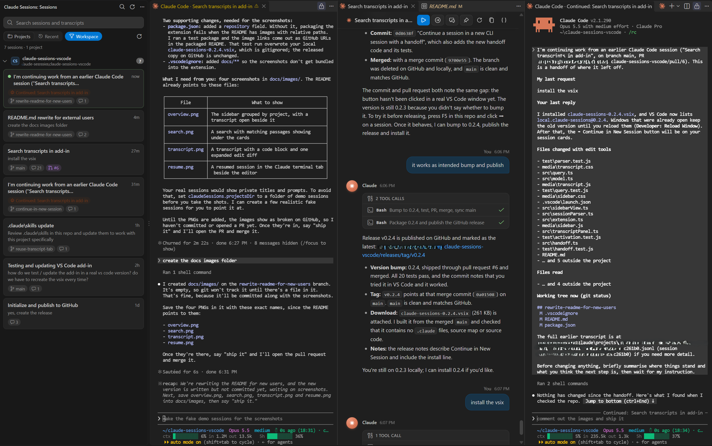

# Claude Sessions

**Find, read and pick up any Claude Code session without leaving VS Code. Your GitHub Copilot CLI and VS Code Chat sessions show up too.**

[Claude Code](https://claude.com/claude-code) saves every conversation you have with it, but finding an old one means scrolling through `claude --resume` and guessing from the first line. Claude Sessions adds a sidebar that shows all of your sessions across every project. You can search everything you and Claude said, read any conversation as a chat transcript, see what each session used and cost (or chart what all of them cost, by day, model and project), and resume it in one click, or carry it over into a fresh session, even in a different tool. Your [GitHub Copilot CLI and VS Code Chat](#github-copilot-cli-and-vs-code-chat-sessions-too) sessions are listed alongside, so one search covers all of them.



## What you can do with it

### Browse every session in one place

The sidebar shows a card for each session with its title, your latest prompt, when it happened, the git branch, how many prompts it has, and badges for subagents and pull requests. A pulsing green dot marks sessions that were active in the last few minutes.

Each card also shows what the session cost, plus a couple of [usage badges](#see-what-a-session-used-and-cost) when they're worth knowing about.

- **Projects** groups sessions by folder, and each project gets its own colored avatar. **Recent** groups them by date (Today, Yesterday, Previous 7 Days, and so on).
- **Workspace** filter: show only the sessions started in the folders you have open in this window.
- **Source chips** under the search box filter by tool (Claude Code, Copilot CLI, VS Code Chat). See [below](#github-copilot-cli-and-vs-code-chat-sessions-too).
- Hover a card for quick actions: resume, continue in a new session, open in Claude Code chat, read the transcript, or copy the session ID. Right-click for more.

The sidebar refreshes on its own as sessions change, and everything follows your VS Code color theme.

### Search everything you and Claude said



Press `/` to search. The search covers the card details and the full conversation: your prompts and Claude's replies, and the paths of files Claude's tools read or edited, but not tool output. When a session matches inside its conversation, its card shows the matching passage.

To find the sessions that worked on a file, right-click it in the Explorer or right-click its editor tab and choose **Search Claude Sessions for This File**. The sidebar opens with the file name in the search box.

| Type | To find |
| --- | --- |
| `auth bug` | sessions containing both words, anywhere, in any case |
| `"race condition"` | the exact phrase |
| `-flaky` or `-"some phrase"` | sessions that *don't* contain it |
| `redis OR postgres` | sessions containing either word |
| `source:copilot` or `-source:chat` | sessions from one tool, or all but one (`claude`, `copilot`, `chat`) |

### Read a session as a chat



Click a session to open its transcript. Your prompts are on the right and Claude's replies are on the left, with markdown, tables and syntax-highlighted code that you can copy.

- Each tool call is a compact row with a ✓ or ✗. Click it to see the input and output. File edits show as a red/green diff.
- Hide tool calls to read just the conversation, or jump straight to the latest message.
- If you opened the transcript from a search, your search words are highlighted and it starts at the first match. Step through matches with F3 / Shift+F3.
- Transcripts open in a single preview tab that the next one replaces, so tabs don't pile up. Double-click a session, or click **Keep open**, to give it a tab of its own.

### See what a session used and cost



The top of each transcript shows the numbers Claude Code's status line shows while a session runs, so you can check them for any session, long after it ended:

| Stat | What it tells you |
| --- | --- |
| **Context** | How full the context window was at the last request. Once it's filling up, continuing in a new session gives Claude room again. |
| **Prompt cache** | Whether the conversation is still cached, with a countdown, and whether it's a 1-hour or 5-minute cache. Resuming while it's warm reads the context at a fraction of the price. After it expires, the whole context is written to the cache again. |
| **Cost at API prices** | What the session's tokens cost at Claude API prices, subagents included. Expand **Cost breakdown** to see each token type. On a Pro or Max plan you aren't billed per token, so this shows what the session would cost through the API. |
| **Tokens** | Tokens in and out, and how much of the input was read from the cache. |

When you scroll down into the conversation, a one-line version of the stats stays in the bar at the top, along with the switch for showing tool calls. Click it to go back to the top.



Cards keep it short. Each one shows the cost, plus two badges that only appear when they're worth acting on:

- **Context**, once the window is more than half full. It turns yellow from 80%.
- **Prompt cache countdown**, while the cache is still warm.

The numbers are worked out on your machine from the token counts in the session logs, using Claude API list prices. They leave out the few small background requests Claude Code doesn't log, such as naming the session.

### See all your sessions at a glance



Click the dashboard button at the top of the sidebar, or run **Claude Sessions: Open Overview**, to open a summary in an editor tab. For the last 7, 30 or 90 days, or all time, it shows:

- **Totals:** cost at API prices, sessions, prompts, projects and active days.
- **Cost per day:** each bar is split by model or by project, whichever you pick under **Color by** (or **Total** for plain bars), with a legend below. Hover a bar for that day's breakdown. A model or project keeps its color when you change the range.
- **Projects and Models:** each one's sessions, prompts, cost and share.
- **Sessions:** the most recently active, or switch to the most expensive. Click one to read its transcript.

The overview starts with the projects in your current workspace. Use the **Projects** menu to switch to **All projects** or tick the ones you want, or click a project's name in the table to show just that one. The page remembers your range, projects and color choice.

Cost is counted on the day each request was made, so a session that ran over several days is split across them.

### Pick up where you left off



You'll find these on each card and at the top of each transcript. This is how they work for Claude Code sessions; [Copilot CLI and VS Code Chat sessions](#github-copilot-cli-and-vs-code-chat-sessions-too) work much the same way.

- **Resume** (▶) opens `claude --resume <id>` in a terminal tab beside your editor, in the session's project folder. If the session is already open, its terminal is focused instead.
- **Continue in New Session** (⮕) starts a fresh session with a handoff of where the old one stopped. The handoff includes your last request, Claude's last reply, the files it edited and read, any open to-dos, the current `git status`, and the path to the old transcript. If you asked the old session to write a handoff (for example "save a handoff.md for this session", or a handoff skill), the new prompt opens with where it was saved, including any copies, and tells Claude to read it first. Claude is asked to summarize and wait for your instruction before changing anything. Use this when a session has grown too long to keep working in.
- **Continue in New Session with Tool or Model…** does the same, but first asks where the new session runs: Claude Code, GitHub Copilot CLI or VS Code Chat. For a CLI it then asks which model and effort level to use, instead of that CLI's settings. This also lets you move work between tools, for example from a Copilot chat to Claude Code. Find it in a card's right-click menu, or click the ⌄ next to **Continue in new session** in a transcript.
- **Open in Claude Code Chat** reopens the session in the chat panel of the official Claude Code extension, if you have it installed.

### GitHub Copilot CLI and VS Code Chat sessions too

The sidebar also lists your [GitHub Copilot CLI](https://docs.github.com/en/copilot/how-tos/copilot-cli) sessions and your VS Code Chat (GitHub Copilot Chat) conversations, next to your Claude Code sessions. Each card has a badge naming its tool. You can search all of them and read any of them as a transcript.

- **Source chips** under the search box: **All**, then one chip per tool with its session count. Click a chip to show only that tool's sessions, then click others to add them. Click a chosen chip to remove it, and removing the last one goes back to **All**. The chips appear once more than one tool has sessions. They change the current window only. The `claudeSessions.sources` setting chooses what a new window starts with.
- **Resume** runs `copilot --resume <id>` for a Copilot CLI session. For a VS Code chat, the button reads **Open in Chat**. It opens the conversation in this window if the chat belongs to this window's folder. If it doesn't, you can open that folder in a new window, because VS Code shows a chat only in the window of its own folder.
- **Continue in New Session** works for these sessions too. A Copilot CLI session continues in a new Copilot CLI session. A VS Code chat continues in a new chat in agent mode, with the handoff in the input box so you can pick a model and press Enter.
- Open in Claude Code Chat, and the usage and cost figures, are for Claude Code sessions only. Copilot logs record no token usage, so the overview labels its cost **Claude only** when other tools are shown. The overview has its own source chips.

Sessions are read from `~/.copilot/session-state` (or `$COPILOT_HOME`), and from the `workspaceStorage` folders of VS Code and VS Code Insiders. Chats from remote, WSL or SSH windows, and from other editors built on VS Code, are not included.

## Install

You need **VS Code 1.90 or newer**. To use Resume and Continue in New Session, you also need the **[Claude Code CLI](https://docs.claude.com/en/docs/claude-code/setup)** installed, so that `claude` runs in a terminal.

The other tools are optional. Their sessions are listed whenever their logs are on your machine, but to resume or continue them you need:

- **[GitHub Copilot CLI](https://docs.github.com/en/copilot/how-tos/copilot-cli)**, so that `copilot` runs in a terminal, for Copilot CLI sessions.
- The **GitHub Copilot Chat** extension, for opening VS Code chats and continuing work in a new chat.

Claude Sessions isn't on the VS Code Marketplace yet. To install it:

1. Download the latest `claude-sessions-<version>.vsix` from the [Releases page](https://github.com/rellik92j/claude-sessions-vscode/releases/latest).
2. In VS Code, open the Extensions view, click the `…` menu at the top, and choose **Install from VSIX…**. Then pick the file you downloaded.

   Or, from a terminal:

   ```sh
   code --install-extension claude-sessions-0.3.0.vsix
   ```

3. Click the **Claude Sessions** icon in the Activity Bar.

To update, install the newer `.vsix` the same way.

## Privacy

Claude Sessions only reads the session logs that are already on your machine: Claude Code's in `~/.claude/projects` (or `$CLAUDE_CONFIG_DIR/projects` if you set it), GitHub Copilot CLI's in `~/.copilot/session-state`, and VS Code Chat's in VS Code's `workspaceStorage` folder. It sends nothing over the network, and it never changes or deletes your logs.

## Keyboard shortcuts

In the sidebar:

| Key | Action |
| --- | --- |
| `/` | Focus search |
| Enter (in the search box) | Open the first matching session |
| Esc (in the search box) | Clear the search |
| ↑ / ↓ | Move between sessions |
| ← / → | Collapse or expand a group |
| Enter | Open transcript |
| Ctrl+Enter (Cmd+Enter on macOS) | Resume |

In a transcript: F3 / Shift+F3 step through search matches, and Esc clears them.

The **Claude Sessions: Search Sessions…** command in the Command Palette searches transcripts too, and **Claude Sessions: Open Overview** opens the overview.

## Settings

| Setting | Default | Description |
| --- | --- | --- |
| `claudeSessions.sources` | all three | Tools whose sessions a new window shows: `claude`, `copilot-cli`, `vscode-chat`. |
| `claudeSessions.projectsDir` | `""` | Folder with Claude Code's session logs. Empty means `$CLAUDE_CONFIG_DIR/projects` or `~/.claude/projects`. |
| `claudeSessions.copilotDir` | `""` | GitHub Copilot CLI's folder. Empty means `$COPILOT_HOME` or `~/.copilot`. |
| `claudeSessions.vscodeUserDir` | `""` | VS Code's user data folder, for chats. Empty means the default folders of VS Code and VS Code Insiders. |
| `claudeSessions.groupBy` | `project` | Group sessions by `project` or `date`. |
| `claudeSessions.currentWorkspaceOnly` | `false` | Only show sessions from the open workspace folders. |
| `claudeSessions.hideEmptySessions` | `true` | Hide sessions with no prompts or replies. |
| `claudeSessions.claudeCommand` | `claude` | Command used to launch Claude Code when resuming or continuing. |
| `claudeSessions.copilotCommand` | `copilot` | Command used to launch GitHub Copilot CLI when resuming or continuing. |
| `claudeSessions.terminalLocation` | `editor` | Open CLI terminals as an `editor` tab or in the bottom `panel`. |
| `claudeSessions.showThinking` | `false` | Show Claude's thinking blocks in transcripts. |
| `claudeSessions.reuseTranscriptTab` | `true` | Reuse one preview tab for transcripts. When off, every transcript gets its own tab. |

## Development

```sh
npm install
npm test          # compile, bundle and run unit tests (plus a smoke test against your real ~/.claude/projects)
npm run package   # build claude-sessions-<version>.vsix
```

Press F5 with this folder open to run the extension in a development host.

How the code is laid out:

| Path | What it does |
| --- | --- |
| `src/extension.ts` | Activation, commands, file watching, resuming and continuing sessions |
| `src/sessionStore.ts` | Find and load the session logs of every tool (cached by file size and time) |
| `src/sessionParser.ts`, `src/copilotCliParser.ts`, `src/vscodeChatParser.ts` | Parse Claude Code, GitHub Copilot CLI and VS Code Chat logs |
| `src/sources.ts`, `src/transcripts.ts` | What differs between the tools, and picking the right parser for a transcript |
| `src/usage.ts` | Tokens, API-priced cost (also by day and model), context fill and prompt-cache state |
| `src/model.ts`, `src/query.ts` | Loaded sessions, grouping and filters, and the search syntax |
| `src/sidebarView.ts`, `media/sidebar.*` | The sidebar webview |
| `src/transcriptPanel.ts`, `src/markdown.ts`, `media/transcript.*` | Transcript tabs |
| `src/overview.ts`, `src/overviewPanel.ts`, `media/overview.*` | The overview tab: `overview.ts` builds the numbers, the panel picks the projects |
| `src/handoff.ts` | The prompt that starts Continue in New Session |

Files without VS Code imports (the three parsers, `usage`, `query`, `overview`, `handoff`, `markdown`, `format`) are unit tested directly from `out/`; `test/activation.test.js` loads the bundled extension against a fake VS Code API and drives the webviews' messages.

## License

[MIT](LICENSE)
